# Implementation Plan — UAT Requirements 41–60

**Goal:** Implement continuation-meeting requirements on top of baseline 1–40.  
**Source of truth:** [REQUIREMENTS.md](./REQUIREMENTS.md)  
**Date:** 8 July 2026

---

## Locked product decisions

1. **Verify Delivery removed from the happy path** — drop nav, route, and GRN create gate. Keep `DeliveryVerification` model for historical rows only (no new soft dependency).
2. **FIFO via new `StockBatch`** — each accepted GRN line creates a batch (`qtyRemaining`, `receivedAt`, `grnId`). Issues consume oldest batches first. Existing aggregate `StockLedger` qty syncs from batches; opening stock becomes one synthetic batch dated `lastMovementAt`.
3. **Dashboard tabs** become **Pending / Completed / Rejected / All** (replace Approved). Backend already supports `tab=rejected`.
4. **Multi-vendor POs** reuse existing per-line vendor assignment + “Split PO by vendor”; when multiple vendors are selected, wizard creates **one PO per vendor** with shared indent/addresses and per-vendor “why we chose” remarks.
5. **Status labels** always show **next approver**: `Pending at {Role}` (never “Accepted at Store” / “Store accepted” as the primary queue label).

```mermaid
flowchart LR
  subgraph phase1 [Phase1 UX]
    R41[IndentTable]
    R42[DashboardTabs]
    R58[StatusLabels]
  end
  subgraph phase2 [Phase2 GRN]
    R43[DropVerifyDelivery]
    R45[TraceabilityFields]
    R47[ReceiptListing]
  end
  subgraph phase3 [Phase3 Issue]
    R48[IssueTable]
    R51[IssueToLogic]
    R52[ContractorAck]
  end
  subgraph phase4 [Phase4 Stock]
    R53[Registers]
    R54[SlimInventory]
  end
  subgraph phase5 [Phase5 FIFO]
    R55[StockBatchFIFO]
    R57[AgingReport]
  end
  subgraph phase6 [Phase6 RFQ]
    R59[ExpandableCompare]
    R60[MultiVendorPOs]
  end
  phase1 --> phase2 --> phase3 --> phase4 --> phase5 --> phase6
```

---

## Phase 1 — Indent listing, dashboard filters, status labels (41, 42, 58)

### 41 — Compact indent table
- Rewrite [`MaterialIndentsTable.tsx`](e:\Bekem\apps\web\src\components\MaterialIndentsTable.tsx) to **one row per indent** (not per line item).
- Columns only: **Indent Number | Indent Date | Purpose | Category | Raised By | Status**.
- Keep row click → detail (existing `onRowClick`).
- Reuse on Store pending/complete ([`StorePendingRequests.tsx`](e:\Bekem\apps\web\src\pages\store\StorePendingRequests.tsx), [`StoreCompleteIndents.tsx`](e:\Bekem\apps\web\src\pages\store\StoreCompleteIndents.tsx)), HO indent lists, and Site [`MyRequests.tsx`](e:\Bekem\apps\web\src\pages\site\MyRequests.tsx) (swap cards for table on desktop density).

### 42 — Dashboard tabs
- Update Site (and any shared indent tab strips) from `All / Pending / Approved / Completed` → **`Pending / Completed / Rejected / All`**.
- Wire `tab=rejected` (already in [`materialRequests.js`](e:\Bekem\apps\api\src\routes\materialRequests.js) L224).
- Collapse duplicate “Pending Indents / Completed Indents / All Indents” dashboard blocks into the same four filters where they appear ([`StoreHome.tsx`](e:\Bekem\apps\web\src\pages\store\StoreHome.tsx), Site home lists).

### 58 — Next-approver status labels
- Centralize display in [`StatusBadge.tsx`](e:\Bekem\apps\web\src\components\ui\StatusBadge.tsx) + `formatIndentQueueStatus` in MaterialIndentsTable.
- Prefer `pendingWith` → **`Pending at {ROLE_LABELS}`**.
- Replace labels like `Store accepted` / `Accepted` with next-queue phrasing (e.g. ALLOCATED → Pending at PM when pending).

---

## Phase 2 — GRN flow & listing (43–47)

### 43 / 44 — Remove Verify Delivery gate
- [`goodsReceipts.js`](e:\Bekem\apps\api\src\routes\goodsReceipts.js) `GET /pending-purchase-orders`: return `APPROVED` + `fulfillmentStatus ≠ closed_complete` (**no** DeliveryVerification filter).
- Remove verification check on `POST /goods-receipts`.
- Remove Store nav + route: [`roleNav.ts`](e:\Bekem\apps\web\src\lib\roleNav.ts), [`App.tsx`](e:\Bekem\apps\web\src\App.tsx) `/store/verify-delivery`.
- Update empty-state copy in [`GrnReceive.tsx`](e:\Bekem\apps\web\src\pages\store\GrnReceive.tsx) and [`IssueMaterial.tsx`](e:\Bekem\apps\web\src\pages\store\IssueMaterial.tsx).
- Keep capability/model; stop requiring them. Update GRN integration tests that seed DeliveryVerification first.

### 45 — Traceability on GRN
- On create, denormalize onto `GoodsReceiptNote`: `indentNumber`, `poNumber`, `vendorId`, `vendorName` (resolved via PO → PR → MaterialRequest).
- Enrich `GET /goods-receipts` serializer with those fields.

### 46 — Multiple GRNs per PO
- Already supported (counter + tests). No model change. Mark DONE after listing polish.

### 47 — Material Receipt listing
- Landing on Material Receipt shows history table: **GRN# | PO# | Indent# | Vendor | Receipt Date | Status**.
- Selecting a pending PO still opens the receive form. Click GRN row → detail/PO GRN section.

---

## Phase 3 — Material Issue (48–52)

### 48 — Issue line table
- Replace `StockComparisonTable` on Issue detail with Issue-specific columns:  
  **Item Code | Item Description | Available Qty | Issued Qty | Balance Qty | Unit**  
  (Issued editable / default = available or remaining; Balance = Available − Issued).  
  **Remove Requested Quantity** from this screen.

### 49 — Material Issue Date
- Show **Material Issue Date** (default today; persist `issuedAt` on create — use `createdAt` / new explicit field). Do not display PO Date on this screen.

### 50 — Issue types
- Already `WORK_ISSUE` / `CONTRACT_ISSUE` only in shared constants — verify UI has no other types.

### 51 — Issue To logic
- Work Issue → mandatory **Employee Name** only (auto-set `issuedToType=EMPLOYEE`).
- Contract Issue → mandatory **Contractor Name** only (`issuedToType=CONTRACTOR`).
- Remove free-standing Department option from this flow.

### 52 — Contractor acknowledgement
- When Contract Issue: optional file upload with category `CONTRACTOR_ACK` (separate from generic issue slip).

---

## Phase 4 — Registers & slim inventory (53–54)

### 53 — Three registers (new Store page)
- Route e.g. `/store/registers` with tabs:
  - **Inward** — GRN list (reuse enriched receipts API)
  - **Outward** — Material Issues list
  - **Stock** — `Current = Total Inward − Total Outward` per material (from movements / batches)
- Nav entry under Store.

### 54 — Slim inventory columns
- Add **Balance** view (Store primary) on stock/registers:  
  **Item Code | Item Description | Unit | Total Received | Total Issued | Current Balance**  
  No HSN/GST on this view. Keep existing wide finance [`StockPage.tsx`](e:\Bekem\apps\web\src\pages\store\StockPage.tsx) for Coordinator/Chairman as-is.

---

## Phase 5 — FIFO & aging (55–57)

### 55 — FIFO consumption
- New model `StockBatch`: `{ siteId, materialId, grnId, grnNumber, receivedAt, qtyReceived, qtyRemaining }`.
- Create batches in `applyGrnStockAndSideEffects` ([`grnHoldService.js`](e:\Bekem\apps\api\src\services\grnHoldService.js)).
- On issue ([`materialIssues.js`](e:\Bekem\apps\api\src\routes\materialIssues.js)): allocate qty across oldest `qtyRemaining > 0` batches; write movement with batch consumption details; update `StockLedger.quantityOnHand`.
- No UI batch picker.

### 56 / 57 — Aging analysis + report
- Aging days = `today − batch.receivedAt`.
- API `GET /stock/aging` (and optional PDF/CSV later).
- UI page `/store/stock-aging`: Item | Batch/GRN | Received Date | Available Qty | Aging (Days).
- Link from Registers / Stock.

---

## Phase 6 — RFQ comparison & multi-vendor PO (59–60)

### 59 — Expandable per-item comparison
- Evolve [`QuotationComparisonTable.tsx`](e:\Bekem\apps\web\src\components\QuotationComparisonTable.tsx) and RFQ detail compare:  
  **Item header → expand → vendors as columns with Rate | GST | Final Cost** (compact, no dropdown-primary UX).
- Align [`PoProductCompareStep.tsx`](e:\Bekem\apps\web\src\components\PoProductCompareStep.tsx) with the same expandable pattern (already row-per-vendor per item — refine to vendor-columns table).

### 60 — Separate POs per vendor
- When line vendors differ, PO create path groups lines by vendor and creates **N POs**, each with:
  - Registered office + delivery addresses  
  - Vendor details + material list  
  - Payment terms  
  - Per-vendor **Why We Chose This Vendor** remarks  
- Reuse existing split logic in [`PoMaterialVendorAssign.tsx`](e:\Bekem\apps\web\src\components\PoMaterialVendorAssign.tsx) + wizard submit; harden API if create currently forces single vendor.

---

## Tests & verification

| Area | Tests / checks |
|------|----------------|
| GRN without verify | Update `grnPartialMulti.integration.test.js`, pending-PO tests |
| FIFO | New unit/integration: two GRNs different dates → issue consumes older first |
| Issue To | Validation tests WORK→employee, CONTRACT→contractor |
| Tabs | API `tab=rejected`; UI smoke |
| Status labels | Snapshot/helper unit for next-approver mapping |
| Multi PO | Wizard/integration: two vendors → two PO numbers |

Also rebuild `@afios/shared` after constant/DTO changes; run `npm run test -w @afios/api`.

---

## Out of scope (this pass)

- Deleting `DeliveryVerification` collection / capability permanently (kept dormant).
- Mobile Face ID approval (Req 17 — already baseline).
- Rewriting finance Excel-style StockPage column set for Coordinator.

---

## Implementation order when executing

1. Phase 1 (fast UI)  
2. Phase 2 (GRN unblock)  
3. Phase 3 (Issue UX)  
4. Phase 4 (Registers)  
5. Phase 5 (FIFO — densest backend)  
6. Phase 6 (RFQ / multi PO)  
7. Update [`REQUIREMENTS.md`](./REQUIREMENTS.md) statuses 41–60 → DONE/PARTIAL as verified.
